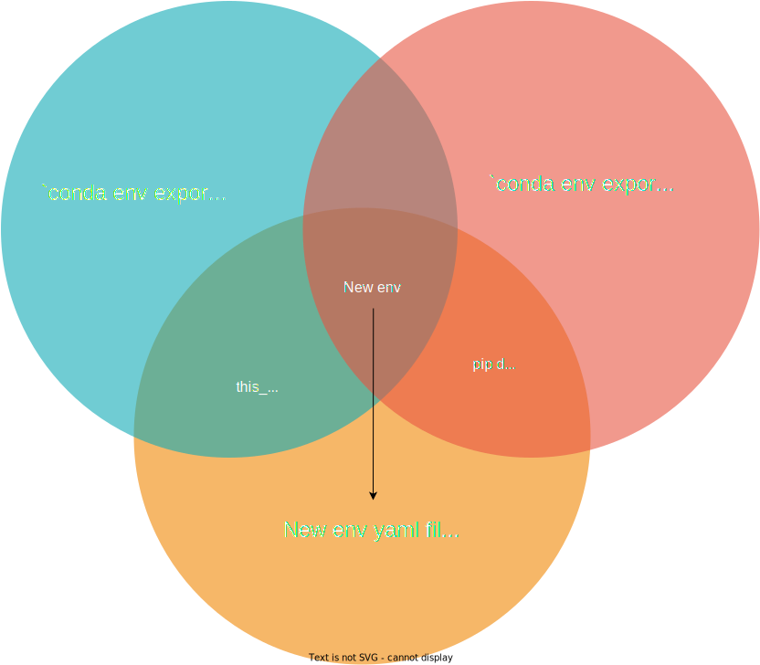

# Q: What is `new_conda_env`?
# A: A new env from an existing one... 

This (future) conda-forge package outputs a "lean" yaml either for an existing conda environment or for a new one when, for instance, a user wants to replicate an existing env but with a different kernel version. 
The "lean" qualifyer reflects both the smaller size of the yaml file: only the user-installed packages &mdash; and those listed in .condarc &mdash; appear and the version-less listing of all dependencies - except for that of the (python) kernel.  

* **Caveats:**
  - At the moment, python is the first (& only) kernel considered.
  - **There is no guarantee that the new environment is satisfiable** e.g. some packages in envA using python 3.x may not exist in envB using python 3.y. The statisfiability check is left to be done by conda at the moment of installation. Unfortunately, there is no `-dry-run` option for `conda env create -f file.yml` (see [conda issue #7495](https://github.com/conda/conda/issues/7495)), so the user must be prepared for possible fatal errors at creation time.

# Use case (python kernel)

You've created a conda environment, which you would like to re-create with a different (python) kernel version, i.e. you would like to have the same packages for a new version of the kernel.
* Example: You have a current python 3.10 conda environment for GIS applications, geo310. When you learn that there is a package that does exactly what you had planned to do, you want to install it... Except, that package is using python 3.9, so you need to reproduce the python 3.10 environment to work with the lower version.

# Limitations of the current `conda env export` command:
1. The usual `conda env export > environment.yml` or `conda env export --no-builds > environment.yml` commands fix all packages dependencies, so they will not work with another (python) kernel version.
2. Using the `--from-history` option, e.g.: `conda env export --from-history > environment.yml` is closer to what's needed because it lists all the packages you installed at the command line, but __it excludes all pip installations__!

# Manual workaround
 1. Create a "minimal" `env_hist.yml` file from an existing environment using the `--from-history` option
 2. Create a "complete" `env_nobld.yml` file using the `--no-builds` option
 3. Edit `env_hist.yml`:    
   3.1 Change `name` to that of the new environment  
   3.2 Insert the missing pip installations (minus version numbers) listed in `env_nobld.yml` in the dependencies list & change the python version to the new one (or insert a line for python if missing)  
   3.3 Change the prefix line so that the path uses the new `name`  
 4. Save `env_hist.yml`, or 'save as' a better name hinting at the creation process, e.g. `env39_from_geo310.yml`. (Note: `env39` would be the default naming pattern if no name is provided for the new env.)

# Solution implemented in `new_conda_env`:
### => The package automates the manual workaround.  

# User-supplied data:
1. `old_ver`: The old version of the kernel in (major[.minor] format)
2. `new_ver`: The new version of the kernel to use (major[.minor] format)
3. `dotless_ver`: Whether to remove version period in env names
4. `env_to_clone`: The name of the conda env to "quick-clone"
5. `new_env_name (optional)`: The name for the new environment
6. `kernel (optional)`: Default & only kernel implemented: python
7. `display_new_yml (optional, True)`: Whether to display the new yml file
8. `log_level (optional, 'ERROR')`: for logging control
                                 
# Output:
The final file is named using this pattern: `f"env_{kernel[:2]}{new_ver}_from_{env_to_clone}.yml"` 

# Call example
`python -m new_conda_env.main -old_ver 3.10 -new_ver 3.9 -dotless_ver 1 -env_to_clone ds310 -new_env_name ds39`

# TODO
 [ x ] Create all needed processing functions
 [ x ] cli: Create
 [ x ] Add check in argparse: kernel version needs a dot
 [ ] Add tests
 [ ] Upload to conda-forge
 [ ] Do same for julia, R kernels (if requested with enhancement issues)  
 
---

### What's yaml (yml)?
>"YAML is a data serialization format designed for human readability and interaction with scripting languages"
#### More about [yaml](https://github.com/yaml/yaml-spec/blob/main/spec/1.2.2/spec.md) and [ruamel.yaml (used by conda)](https://pypi.org/project/ruamel.yaml/)
